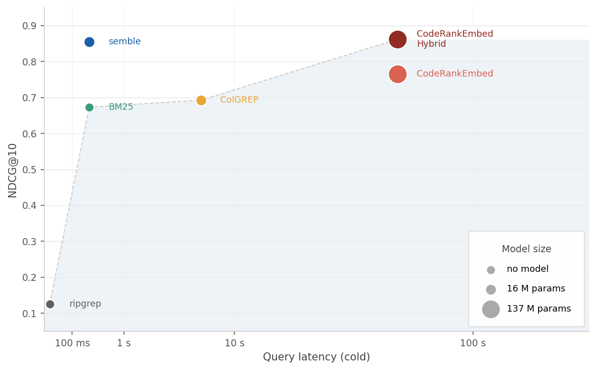
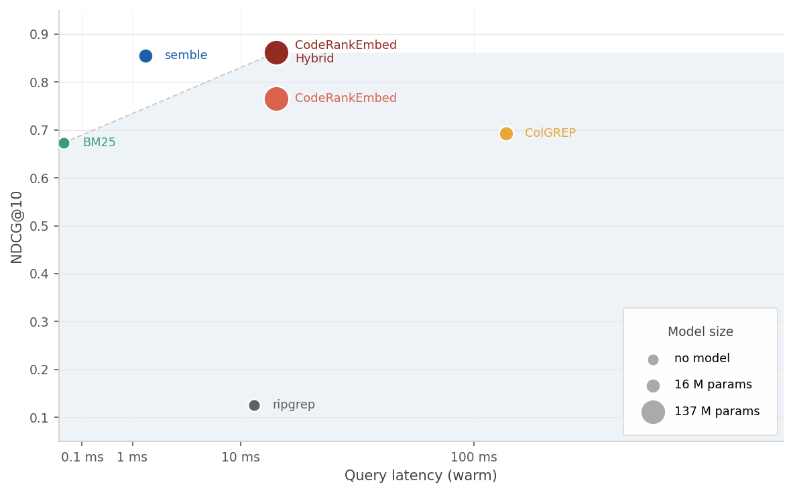
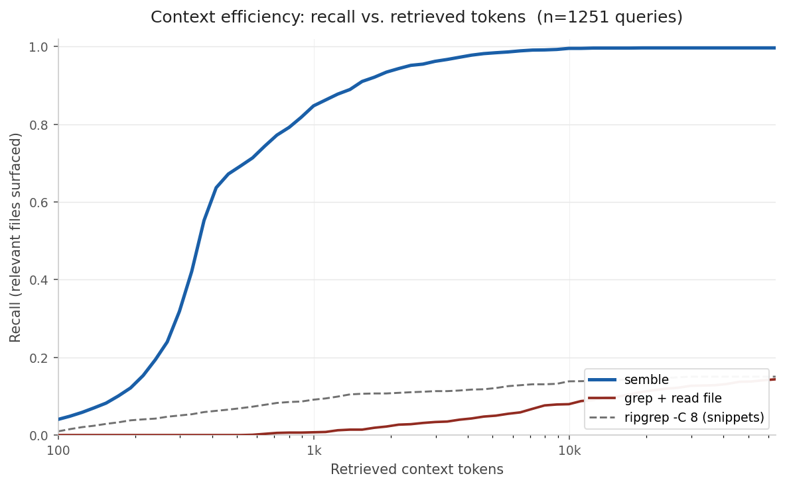

# Benchmarks

Quality and speed benchmarks for `semble`.

- [Main results](#main-results)
- [By language](#by-language)
- [Context efficiency](#context-efficiency)
- [Ablations](#ablations)
- [Dataset](#dataset)
- [Methods](#methods)
- [Running the benchmarks](#running-the-benchmarks)

## Main results

Quality and speed across all methods.

| Method | NDCG@10 | Index | Query p50 |
|---|---:|---:|---:|
| CodeRankEmbed Hybrid | 0.862 | 57 s | 16 ms |
| **semble** | **0.854** | **263 ms** | **1.5 ms** |
| CodeRankEmbed | 0.765 | 57 s | 16 ms |
| ColGREP | 0.693 | 5.8 s | 124 ms |
| BM25 | 0.673 | 263 ms | 0.02 ms |
| ripgrep | 0.126 | — | 12 ms |

|  |  |
|:--:|:--:|
| *Time to first result (index + query) vs NDCG@10* | *Query latency on a warm index vs NDCG@10* |

The 137M-param CodeRankEmbed Hybrid wins NDCG@10 by 0.008. semble wins index time by 218x and query latency by 11x.

NDCG@10 is averaged across all queries. Speed numbers use one repo per language, CPU only: cold-start index time and warm query p50 (median across 5 consecutive runs).

## By language

NDCG@10 per language, sorted by CodeRankEmbed Hybrid (CRE in the table). Best score per row is bolded.

| Language | semble | CRE Hybrid | CRE | ColGREP | ripgrep |
|---|---:|---:|---:|---:|---:|
| scala | 0.909 | **0.922** | 0.845 | 0.765 | 0.180 |
| cpp | **0.915** | 0.913 | 0.846 | 0.626 | 0.126 |
| ruby | **0.909** | **0.909** | 0.769 | 0.708 | 0.230 |
| elixir | 0.894 | **0.905** | 0.869 | 0.808 | 0.134 |
| javascript | 0.917 | 0.903 | **0.920** | 0.823 | 0.176 |
| zig | **0.913** | 0.901 | 0.807 | 0.474 | 0.000 |
| csharp | 0.885 | **0.889** | 0.743 | 0.614 | 0.117 |
| go | **0.895** | 0.884 | 0.676 | 0.785 | 0.133 |
| python | 0.867 | **0.880** | 0.794 | 0.777 | 0.202 |
| php | 0.858 | **0.874** | 0.758 | 0.663 | 0.123 |
| swift | 0.860 | **0.873** | 0.721 | 0.710 | 0.160 |
| bash | 0.825 | 0.852 | **0.892** | 0.706 | 0.000 |
| lua | 0.823 | **0.847** | 0.803 | 0.798 | 0.000 |
| java | **0.849** | 0.841 | 0.706 | 0.641 | 0.198 |
| kotlin | 0.821 | **0.830** | 0.670 | 0.637 | 0.166 |
| rust | **0.856** | 0.827 | 0.627 | 0.662 | 0.162 |
| c | 0.741 | **0.806** | 0.706 | 0.676 | 0.000 |
| haskell | 0.765 | 0.771 | **0.776** | 0.683 | 0.000 |
| typescript | 0.706 | **0.708** | 0.545 | 0.430 | 0.128 |
| **overall** | **0.854** | **0.862** | **0.765** | **0.693** | **0.126** |

## Context efficiency

Coding agents often use `grep` to find candidate files and then read those files into context. We model that direct `grep + read file` workflow and compare it with semble's chunk retrieval.

> Across a 198-query category-balanced sample judged by GPT-5-mini, semble's retrieved context answers **88%** of queries at 2k tokens. Direct `grep + read file` answers **29%** and spends ~4k tokens. That is a **50% reduction in retrieved code-context tokens**; with a pessimistic fallback model for misses, expected end-to-end context cost drops by **69%**.



### Answer sufficiency (LLM-as-judge)

For each query we hand the retrieved context to GPT-5-mini and ask whether it contains enough relevant code to answer the query. The sample is 198 queries, balanced 66/66/66 across semantic, architecture, and symbol categories.

- **semble** — top-K chunks, hard-capped at 2k tokens.
- **grep+read** — the raw query string is passed to `rg --fixed-strings`; matching files are read in full, hard-capped at 16k tokens.

Both workflows search the same code-file universe: semble's indexed extensions, excluding `node_modules`, `dist`, `build`, `.venv`, and other ignored directories.

| Method | Budget | Answer rate | Mean tokens retrieved | Token reduction with semble | Expected end-to-end tokens† |
|---|---:|---:|---:|---:|---:|
| **semble** | 2k | **0.879** | 2,000 | — | **2,906** |
| grep+read | 16k | 0.293 | 3,996 | 50.0% | 9,281 |

**Raw retrieval reduction:** 50.0% fewer retrieved code-context tokens vs `grep+read`.
**End-to-end reduction (with fallback model):** 68.7% fewer expected context tokens vs `grep+read`.

†The end-to-end column adds `(1 − answer_rate) × 7,474`, modeling a fallback search on a miss. The constant is the median tokens `grep+read` spends to surface a relevant file. The raw retrieval reduction is the model-free comparison. This benchmark measures retrieved code-context tokens, not total IDE or agent billing tokens.

**Answer rate by query category:**

| Category | semble | grep+read |
|---|---:|---:|
| symbol (named entity lookup) | 0.97 | 0.86 |
| semantic (behavior / concept) | 0.85 | 0.02 |
| architecture (design / structure) | 0.82 | 0.00 |

### Recall at fixed token budgets

A coarser, label-based view across the full 1,251-query benchmark: a relevant file is "covered" once any retrieved unit comes from it.

| Method | 500 | 1k | 2k | 4k | 8k | 16k | 32k |
|---|---:|---:|---:|---:|---:|---:|---:|
| **semble** | **0.684** | **0.848** | **0.936** | **0.976** | **0.991** | **0.996** | **0.996** |
| grep + read file | 0.000 | 0.007 | 0.023 | 0.042 | 0.076 | 0.101 | 0.127 |
| ripgrep -C 8 | 0.069 | 0.091 | 0.107 | 0.117 | 0.131 | 0.143 | 0.150 |

<details>
<summary>Methodology</summary>

For each query we retrieve units in rank order — semble chunks for semble, full files in match-count order for `grep+read`, and merged context windows for `ripgrep -C 8` in the recall curve. Tokens are counted with `cl100k_base` via `tiktoken`. `grep` is run with `--fixed-strings --ignore-case` on the raw query and scoped via `--glob` to the same code-file extensions and ignored directories that semble indexes.

In judge mode each context is hard-capped at its stated budget by token IDs and asserted `len(ids) ≤ budget`. Recall mode does not truncate; its curves record cumulative tokens of whole retrieved units. The judge sample is macro-balanced across categories; the recall benchmark uses all 1,251 queries.

GPT-5-mini sees the query and capped retrieved context and answers a strict yes/no on whether the context contains code that directly addresses the query. A relevant file is "covered" in recall once any retrieved unit comes from it; where line spans are present we require span overlap.

</details>

## Ablations

`raw` returns retrieval scores directly; `+ ranking` feeds them through semble's hybrid ranker.

| Retrieval | Raw | + ranking |
|---|---:|---:|
| BM25 | 0.675 | 0.834 |
| potion-code-16M | 0.650 | 0.821 |
| BM25 + potion-code-16M | — | **0.854** |

<details>
<summary>By query category</summary>

| Mode | Architecture | Semantic | Symbol |
|---|---:|---:|---:|
| BM25 raw | 0.628 | 0.676 | 0.719 |
| potion-code-16M raw | 0.626 | 0.666 | 0.629 |
| semble BM25 (+ ranking) | 0.770 | 0.819 | 0.957 |
| semble potion-code-16M (+ ranking) | 0.757 | 0.808 | 0.943 |
| **semble hybrid** | **0.802** | **0.846** | **0.958** |

</details>

## Dataset

~1,250 queries over 63 repositories in 19 languages, grouped into three categories:

| Category | Queries | What it tests |
|---|---:|---|
| semantic | 711 | Code that implements a specific behavior or concept |
| architecture | 343 | Design decisions, module boundaries, structural patterns |
| symbol | 204 | Named entity lookup (function, class, type, variable) |

<details>
<summary>Notes</summary>

**Languages**: three repos per language (nine for Python): bash, C, C++, C#, Elixir, Go, Haskell, Java, JavaScript, Kotlin, Lua, PHP, Python, Ruby, Rust, Scala, Swift, TypeScript, Zig. Repos are pinned by revision in `repos.json`.

**How the benchmark was built**: queries and ground-truth relevance labels are generated by Claude Sonnet 4.6. The same model is used as LLM-as-judge to verify label quality.

</details>

## Methods

- **[ripgrep](https://github.com/BurntSushi/ripgrep)**: fast regex search over files, included as a raw keyword-match baseline.
- **[ColGREP](https://github.com/lightonai/next-plaid/tree/main/colgrep)**: late-interaction code retrieval built on next-plaid with the [LateOn-Code-edge](https://huggingface.co/lightonai/LateOn-Code-edge) model.
- **[CodeRankEmbed](https://huggingface.co/nomic-ai/CodeRankEmbed)**: 137M-param transformer embedding model for code retrieval. *CodeRankEmbed Hybrid* fuses its dense scores with BM25.
- **[semble](https://github.com/your-repo/semble)**: this library. [potion-code-16M](https://huggingface.co/minishlab/potion-code-16M) static embeddings + BM25 + the semble reranking stack.

## Running the benchmarks

Repos are pinned in `repos.json` and cloned into `~/.cache/semble-bench`:

```bash
uv run python -m benchmarks.sync_repos          # clone / update
uv run python -m benchmarks.sync_repos --check  # verify only
```

All tools run CPU-only. semble uses `minishlab/potion-code-16M`; CodeRankEmbed uses `nomic-ai/CodeRankEmbed` (137M params). The speed benchmark touches one repo per language with a cold-start index and 5 query runs per repo.

<details>
<summary>semble</summary>

```bash
uv run python -m benchmarks.run_benchmark
uv run python -m benchmarks.run_benchmark --repo fastapi --repo axios
uv run python -m benchmarks.run_benchmark --language python
```

Full runs write to `benchmarks/results/semble-hybrid-<sha12>.json`.

</details>

<details>
<summary>Speed benchmark</summary>

```bash
uv run python -m benchmarks.speed_benchmark
```

Writes to `benchmarks/results/speed-<sha12>.json`.

</details>

<details>
<summary>Ablations</summary>

```bash
uv run python -m benchmarks.baselines.ablations
uv run python -m benchmarks.baselines.ablations --mode bm25
uv run python -m benchmarks.baselines.ablations --mode semble-semantic
```

</details>

<details>
<summary>ripgrep</summary>

Needs `rg` on `$PATH` (`brew install ripgrep` / `apt install ripgrep`).

```bash
uv run python -m benchmarks.baselines.ripgrep
uv run python -m benchmarks.baselines.ripgrep --no-fixed-strings
```

</details>

<details>
<summary>ColGREP</summary>

Needs the `colgrep` binary on `$PATH`.

```bash
uv run python -m benchmarks.baselines.colgrep
uv run python -m benchmarks.baselines.colgrep --repo fastapi --repo axios
```

Runs with `--code-only` everywhere except bash repos (bash-it, bats-core, nvm), which use `--no-code-only` because ColGREP's code filter excludes `.sh`/`.bash` files.

</details>

<details>
<summary>CodeRankEmbed</summary>

Requires the `benchmark` extra (`uv sync --extra benchmark`).

```bash
uv run python -m benchmarks.baselines.coderankembed
uv run python -m benchmarks.baselines.coderankembed --mode semantic
```

</details>

<details>
<summary>Context-efficiency benchmark</summary>

Requires the `benchmark` extra (`uv sync --extra benchmark`) and `rg` on `$PATH`. Judge mode also needs `OPENAI_API_KEY`.

```bash
# Recall vs. token-budget across all queries; plots automatically.
uv run python -m benchmarks.context_efficiency recall
uv run python -m benchmarks.context_efficiency recall --repo fastapi

# LLM-as-judge sufficiency on a stratified sample.
uv run python -m benchmarks.context_efficiency judge --sample 200

# Regenerate the plot from a saved recall payload.
uv run python -m benchmarks.context_efficiency plot
```

Writes `benchmarks/results/context-efficiency-{recall,judge}-<sha12>.json`, compact judge records as JSONL, and `assets/images/recall_vs_tokens.png`.

</details>

<details>
<summary>Plots</summary>

```bash
uv run python -m benchmarks.plot
```

Writes `speed_vs_ndcg_cold.png` and `speed_vs_ndcg_warm.png` to `assets/images/`.

</details>
